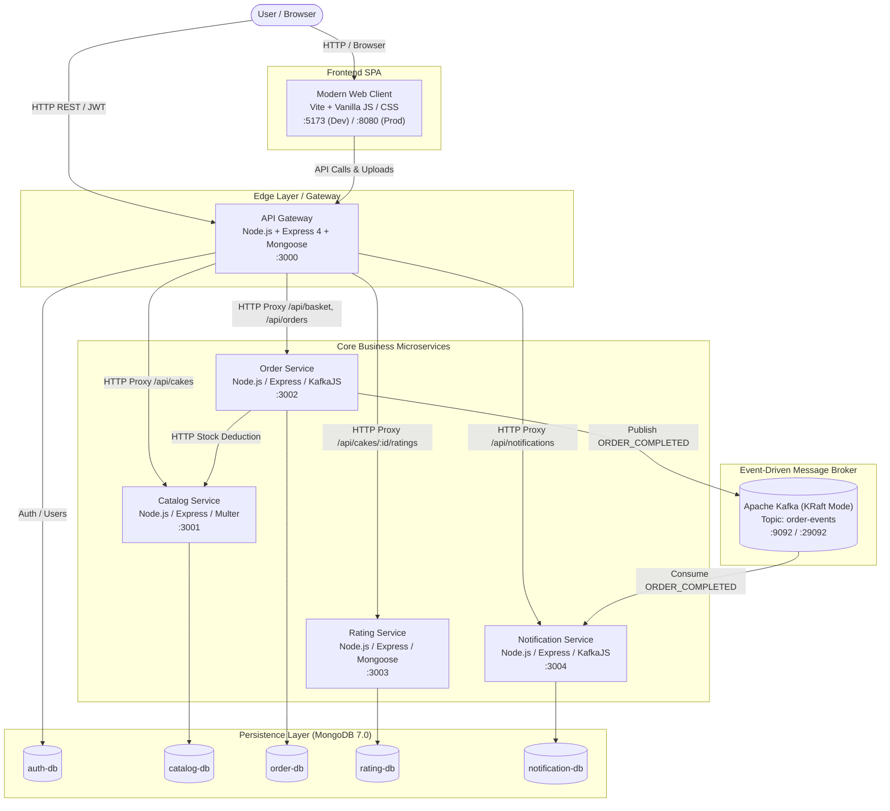
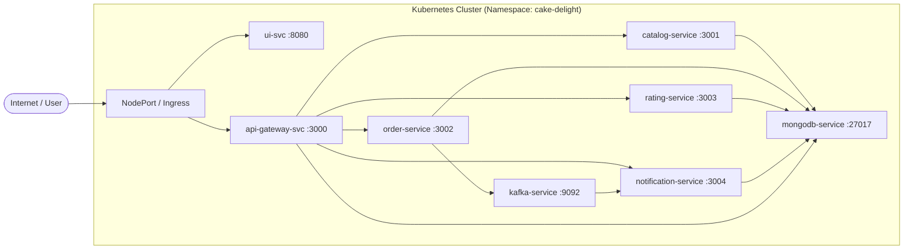

# Cake Delight

> Cloud-Native Microservices Bakery & E-Commerce Platform — Event-Driven Architecture, Inventory Management, and Real-Time Order Processing.

Cake Delight is a cloud-native microservices system designed for an artisanal bakery e-commerce business. It provides:

- **Bakery Catalog & Inventory Management** — Real-time stock control, automated inventory deductions, dietary tagging (100% Eggless), and localized INR pricing
- **Shopping Basket & Order Processing** — Dynamic basket management, pre-checkout stock validations, and transactional order confirmation
- **Customer Reviews & Ratings** — Verified customer ratings (1 to 5 stars), written reviews, and aggregate scoring
- **Event-Driven Notifications** — Asynchronous event streaming via Apache Kafka in KRaft mode, dispatching order confirmations and dispatch logs

All microservices are independently deployable, loosely coupled, containerized with Docker, orchestratable via Docker Compose, and ready for production deployment on Kubernetes.

---

## Live Cloud Deployments (Render)

| Service | Live URL | Description |
|---|---|---|
| **Frontend Web App** | [https://delight-client.onrender.com](https://delight-client.onrender.com) | Production responsive storefront |
| **API Gateway** | [https://delight-gateway.onrender.com](https://delight-gateway.onrender.com) | Central API edge router |
| **Interactive Swagger API Docs** | [https://delight-gateway.onrender.com/api-docs](https://delight-gateway.onrender.com/api-docs) | OpenAPI 3.0 interactive documentation |
| **Gateway Health Check** | [https://delight-gateway.onrender.com/health](https://delight-gateway.onrender.com/health) | Full microservices health aggregator |
| **Catalog Service** | [https://delight-catalog.onrender.com](https://delight-catalog.onrender.com) | Product catalog & inventory |
| **Order Service** | [https://delight-order.onrender.com](https://delight-order.onrender.com) | Shopping basket & checkout |
| **Rating Service** | [https://delight-rating.onrender.com](https://delight-rating.onrender.com) | Reviews & ratings |
| **Notification Service** | [https://delight-notification.onrender.com](https://delight-notification.onrender.com) | Event notifications |

---

## System Architecture



### Services

| Service | Tech Stack | Port | Container / Image | Submodule Repository |
|---|---|---|---|---|
| **Client** | Vite, Vanilla JS, CSS3, Nginx | 5173 / 8080 | `cake-delight/ui` | [`SK963/Delight-Client`](https://github.com/SK963/Delight-Client) |
| **API Gateway** | Node.js 20, Express 4, Mongoose, JWT, Swagger UI | 3000 | `cake-delight/api-gateway` | [`SK963/Delight-Gateway`](https://github.com/SK963/Delight-Gateway) |
| **Catalog** | Node.js 20, Express 4, Mongoose, Multer | 3001 | `cake-delight/catalog-service` | [`SK963/Delight-Catalog`](https://github.com/SK963/Delight-Catalog) |
| **Order** | Node.js 20, Express 4, Mongoose, KafkaJS, Axios | 3002 | `cake-delight/order-service` | [`SK963/Delight-Order`](https://github.com/SK963/Delight-Order) |
| **Rating** | Node.js 20, Express 4, Mongoose | 3003 | `cake-delight/rating-service` | [`SK963/Delight-Rating`](https://github.com/SK963/Delight-Rating) |
| **Notification** | Node.js 20, Express 4, Mongoose, KafkaJS | 3004 | `cake-delight/notification-service` | [`SK963/Delight-Notification`](https://github.com/SK963/Delight-Notification) |
| **MongoDB** | MongoDB 7.0 Alpine | 27017 | `mongo:7` | — |
| **Kafka Broker** | Apache Kafka (KRaft mode, no ZooKeeper) | 9092 / 29092 | `apache/kafka:latest` | — |

---

## Project Structure

```
Delight/
├── UI/                             Frontend Single Page Application
│   ├── src/
│   │   ├── main.js                 App logic, routing, auth, cart, detail, admin
│   │   ├── style.css               Design system & responsive styles
│   │   ├── icons.js                SVG icon components
│   │   └── api.js                  Client API communication layer
│   ├── public/                     Static web assets
│   ├── index.html                  Entry HTML
│   ├── vite.config.js              Vite configuration with dev reverse proxies
│   ├── nginx.conf                  Production Nginx SPA reverse proxy config
│   └── Dockerfile
├── api-gateway/                    Express.js API Gateway & Edge Layer
│   ├── src/
│   │   └── server.js               Auth, RBAC, rate-limiting, proxies, seed admin
│   ├── package.json
│   ├── Dockerfile
│   └── .env.example
├── catalog-service/                Catalog & Inventory Microservice
│   ├── src/
│   │   ├── server.js               Cake CRUD, live stock adjustment, image handling
│   │   ├── seed.js                 Database seeder script
│   │   └── data/
│   │       └── products.json       Bakery catalog seed dataset
│   ├── uploads/                    Static uploaded product images
│   ├── package.json
│   ├── Dockerfile
│   └── .env.example
├── order-service/                  Basket & Order Microservice
│   ├── src/
│   │   └── server.js               Basket management, stock check, Kafka producer
│   ├── package.json
│   ├── Dockerfile
│   └── .env.example
├── rating-service/                 Ratings & Reviews Microservice
│   ├── src/
│   │   └── server.js               Reviews submission & aggregate score engine
│   ├── package.json
│   ├── Dockerfile
│   └── .env.example
├── notification-service/           Notifications Microservice
│   ├── src/
│   │   └── server.js               Kafka consumer for ORDER_COMPLETED events
│   ├── package.json
│   ├── Dockerfile
│   └── .env.example
├── k8s/                            Kubernetes manifests for cluster deployment
│   ├── namespace.yaml              Target namespace (cake-delight)
│   ├── configmap.yaml              Global environment configurations
│   ├── mongodb-deployment.yaml      MongoDB deployment & service
│   ├── kafka-deployment.yaml        Kafka KRaft deployment & service
│   ├── catalog-deployment.yaml      Catalog deployment & service
│   ├── order-deployment.yaml        Order deployment & service
│   ├── rating-deployment.yaml       Rating deployment & service
│   ├── notification-deployment.yaml Notification deployment & service
│   ├── api-gateway-deployment.yaml  API Gateway deployment & NodePort service
│   └── ui-deployment.yaml           Nginx UI deployment & NodePort service
├── docker-compose.yml              Full-stack Docker orchestration
├── docker-compose.infra.yml        Isolated data layer (MongoDB + Kafka KRaft)
├── start.sh                        Automated launch script (infra, all, or stop)
├── problem.md                      System requirements & capstone specification
└── README.md
```

---

## Documentation

> **For a comprehensive understanding of the system, refer to these documents:**

| Document | What's Inside |
|---|---|
| **[api-gateway/src/server.js](api-gateway/src/server.js)** | Edge routing rules, JWT authentication middleware, RBAC checks, request proxy definitions, health check aggregator |
| **[catalog-service/src/data/products.json](catalog-service/src/data/products.json)** | Product master dataset containing categories, weights, INR prices, dietary indicators, and product imagery |
| **[docker-compose.yml](docker-compose.yml)** | Complete multi-container application definitions for local containerized deployment |
| **[docker-compose.infra.yml](docker-compose.infra.yml)** | Lightweight infrastructure setup containing MongoDB 7 and Kafka in KRaft mode |
| **[start.sh](start.sh)** | Shell automation script supporting `--all`, `--infra-only`, and `--stop` operations |
| **[k8s/](k8s/)** | Production Kubernetes manifests across namespace, configmap, deployments, and cluster services |

---

## Running the Project

### Clone Repository (with Submodules)

```bash
git clone --recurse-submodules https://github.com/SK963/cake-delight.git
cd cake-delight
```

If already cloned without submodules:
```bash
git submodule update --init --recursive
```

### Prerequisites

- **Node.js** >= 18 or 20 (for local service execution)
- **Docker** & **Docker Compose** (required for containerized infrastructure and full stack)
- **kubectl** & **Minikube** / **Kind** (optional, for Kubernetes cluster deployment)

---

### Option 1: Run Each Service Individually (Development)

Best for active development with hot-reloading and granular inspection.

**Step 1 — Start infrastructure (MongoDB + Kafka KRaft):**

```bash
./start.sh --infra-only
# Or manually via Docker Compose:
# docker compose -f docker-compose.infra.yml up -d
```

**Step 2 — Start services:**

You can start everything automatically with one command:

```bash
./start.sh --all
```

Or start each service in separate terminal windows:

```bash
# Terminal 1: Catalog Service
cd catalog-service
npm install
npm start                      # -> http://localhost:3001

# Terminal 2: Order Service
cd order-service
npm install
npm start                      # -> http://localhost:3002

# Terminal 3: Rating Service
cd rating-service
npm install
npm start                      # -> http://localhost:3003

# Terminal 4: Notification Service
cd notification-service
npm install
npm start                      # -> http://localhost:3004

# Terminal 5: API Gateway
cd api-gateway
npm install
npm start                      # -> http://localhost:3000

# Terminal 6: Frontend Client
cd UI
npm install
npm run dev                    # -> http://localhost:5173
```

**Step 3 — Stop everything:**

```bash
./start.sh --stop
```

---

### Option 2: Docker Compose — Full Stack

Best for staging validation — runs all services and infrastructure in containerized networks.

**Step 1 — Build and start all containers:**

```bash
docker compose up --build -d
```

**Step 2 — Verify container health:**

```bash
docker compose ps
```

| Service | URL |
|---|---|
| Frontend Web Client | http://localhost:8080 |
| API Gateway | http://localhost:3000 |
| Gateway Health Aggregator | http://localhost:3000/health |
| Swagger API Documentation | http://localhost:3000/api-docs |
| Catalog Health | http://localhost:3001/health |
| Order Health | http://localhost:3002/health |
| Rating Health | http://localhost:3003/health |
| Notification Health | http://localhost:3004/health |

**Step 3 — View logs:**

```bash
docker compose logs -f
# Or inspect specific services:
# docker compose logs -f order-service notification-service
```

**Step 4 — Stop everything:**

```bash
docker compose down
# Add -v flag to also wipe database volumes:
# docker compose down -v
```

---

### Option 3: Kubernetes Deployment (Production)

Deploy to a Kubernetes cluster using native manifests and service discovery.



**Step 1 — Build Docker container images:**

```bash
docker build -t cake-delight/api-gateway:latest ./api-gateway
docker build -t cake-delight/catalog-service:latest ./catalog-service
docker build -t cake-delight/order-service:latest ./order-service
docker build -t cake-delight/rating-service:latest ./rating-service
docker build -t cake-delight/notification-service:latest ./notification-service
docker build -t cake-delight/ui:latest ./UI

# If using Minikube, load images directly into the cluster:
# minikube image load cake-delight/api-gateway:latest
# minikube image load cake-delight/catalog-service:latest
# minikube image load cake-delight/order-service:latest
# minikube image load cake-delight/rating-service:latest
# minikube image load cake-delight/notification-service:latest
# minikube image load cake-delight/ui:latest
```

**Step 2 — Apply manifests in dependency order:**

```bash
# 1. Namespace and configuration
kubectl apply -f k8s/namespace.yaml
kubectl apply -f k8s/configmap.yaml

# 2. Database and message broker
kubectl apply -f k8s/mongodb-deployment.yaml
kubectl apply -f k8s/kafka-deployment.yaml

# 3. Wait for infrastructure readiness
kubectl wait --for=condition=ready pod -l app=mongodb -n cake-delight --timeout=60s
kubectl wait --for=condition=ready pod -l app=kafka -n cake-delight --timeout=60s

# 4. Core business microservices
kubectl apply -f k8s/catalog-deployment.yaml
kubectl apply -f k8s/order-deployment.yaml
kubectl apply -f k8s/rating-deployment.yaml
kubectl apply -f k8s/notification-deployment.yaml

# 5. API Gateway & Frontend UI
kubectl apply -f k8s/api-gateway-deployment.yaml
kubectl apply -f k8s/ui-deployment.yaml
```

**Step 3 — Access and port-forwarding:**

| Service | Port Forward Command | Accessible URL |
|---|---|---|
| Frontend Web Client | `kubectl port-forward svc/ui-svc 8080:8080 -n cake-delight` | http://localhost:8080 |
| API Gateway | `kubectl port-forward svc/api-gateway-svc 3000:3000 -n cake-delight` | http://localhost:3000 |
| Gateway Health Check | `kubectl port-forward svc/api-gateway-svc 3000:3000 -n cake-delight` | http://localhost:3000/health |
| Interactive Swagger Docs | `kubectl port-forward svc/api-gateway-svc 3000:3000 -n cake-delight` | http://localhost:3000/api-docs |

**Teardown:**

```bash
kubectl delete namespace cake-delight
```

---

## API Endpoints (Quick Reference)

| Method | Path | Auth | Description |
|---|---|---|---|
| `POST` | `/api/auth/register` | No | Register new customer account |
| `POST` | `/api/auth/login` | No | Login and obtain signed JWT token |
| `GET` | `/api/auth/me` | Yes | Get authenticated user profile & role |
| `GET` | `/health` | No | Aggregated gateway and microservices health check |
| `GET` | `/api/cakes` | Optional | Browse cakes with search, category, and price filters |
| `GET` | `/api/cakes/:id` | Optional | Retrieve cake detail by ID |
| `POST` | `/api/cakes` | Admin | Add new cake with price, quantity, and image |
| `PUT` | `/api/cakes/:id` | Admin | Update existing cake details |
| `DELETE` | `/api/cakes/:id` | Admin | Delete a cake from inventory |
| `PATCH` | `/api/cakes/:id/stock` | Admin | Adjust available stock count for a cake |
| `GET` | `/api/basket` | Yes | Fetch active customer basket and item count |
| `POST` | `/api/basket/items` | Yes | Add item to basket with quantity check |
| `PATCH` | `/api/basket/items/:cakeId` | Yes | Update item quantity in basket |
| `DELETE` | `/api/basket/items/:cakeId` | Yes | Remove item from basket |
| `POST` | `/api/orders/checkout` | Yes | Validate stock, deduct inventory, place order, emit Kafka event |
| `GET` | `/api/orders/:id` | Yes | Retrieve order details by order ID |
| `GET` | `/api/orders` | Yes | List customer order history |
| `GET` | `/api/cakes/:cakeId/ratings` | Optional | List all verified reviews and ratings for a cake |
| `GET` | `/api/cakes/:cakeId/ratings/summary` | Optional | Calculate aggregate review score and total review count |
| `POST` | `/api/cakes/:cakeId/ratings` | Yes | Submit 1 to 5 star rating and customer review |
| `GET` | `/api/notifications` | Yes | Retrieve dispatched order confirmation alerts |

---

## Event-Driven Architecture (Apache Kafka)

The system utilizes an asynchronous event-driven pattern for order lifecycle transitions.

```
+---------------+                    +-------------------------+                    +----------------------+
|               |  Publish Event     |                         |  Consume Event     |                      |
| Order Service | -----------------> | Topic: 'order-events'   | -----------------> | Notification Service |
|               |                    | (Apache Kafka in KRaft) |                    |                      |
+---------------+                    +-------------------------+                    +----------------------+
```

### Event Specification

When checkout completes in `order-service`, an `ORDER_COMPLETED` event is published to the `order-events` topic:

```json
{
  "eventId": "6a7d3c5b6f25a70f12095b8f",
  "eventType": "ORDER_COMPLETED",
  "occurredAt": "2026-08-13T03:39:07.638Z",
  "data": {
    "orderId": "6a7d3c5b6f25a70f12095b8e",
    "customerId": "6a7d3091862dc8e475da128c",
    "customerEmail": "customer1@example.com",
    "items": [
      {
        "cakeId": "6a7d394fbe576081a8aecdf5",
        "name": "Lotus Biscoff Cheesecake",
        "price": 699,
        "weight": "500g",
        "quantity": 1
      }
    ],
    "total": 699
  }
}
```

The **Notification Service** listens to the `order-events` topic as an independent consumer group, creates a record in `notification-db`, and records dispatch confirmation.

---

## Default Credentials & Roles

The system automatically initializes an administrative user on first launch:

| Role | Email | Password | Access Capabilities |
|---|---|---|---|
| **Bakery Admin** | `admin@cakedelight.com` | `admin123` | Full inventory dashboard, add/edit/delete cakes, adjust stock levels |
| **Customer** | `customer1@example.com` | `password123` | Browse catalog, submit ratings & reviews, add to cart, checkout |

---

## License

This project was developed for the Cake Delight Cloud-Native Microservices Capstone. Distributed under the MIT License.
